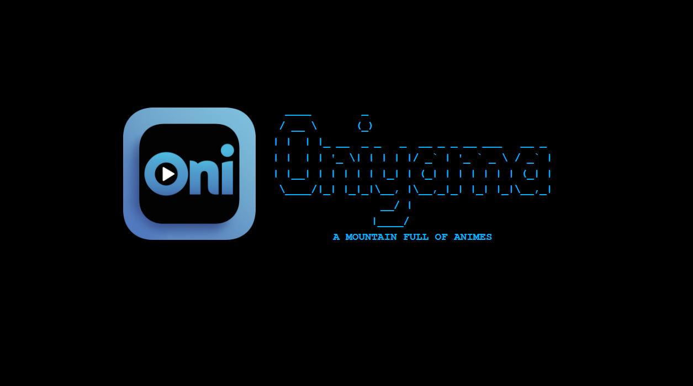

  

# Oniyama - Anime Streaming Application

Oniyama is a sleek and intuitive anime streaming application built with Electron.js. It allows users to watch their favorite anime series and movies with ease.

## Features

- **Extensive Anime Library:** Browse and watch a vast collection of anime series and movies.
- **Search Functionality:** Easily search for specific anime titles or genres.
- **User-Friendly Interface:** Intuitive UI design for a seamless streaming experience.
- **Customizable Settings:** Adjust playback settings, and more to suit your preferences.
- **Automatic Updates:** Stay up-to-date with the latest anime releases and application updates.

## Downloads

  
  
  

  <a href="https://github.com/Shuvadip-Ghosh/Oniyama/raw/master/windows-installer.exe" style=";margin-right:2rem;">Download Windows</a>
  <a href="https://github.com/Shuvadip-Ghosh/Oniyama/raw/master/linux-installer.deb" style=";margin-right:2rem;">Download Linux</a>
  <a href="https://github.com/Shuvadip-Ghosh/Oniyama/raw/master/macos-installer.dmg" style=";margin-right:2rem;">Download macOS</a>

## Usage

1. Launch the Oniyama application after installation.
2. Allow it to fetch data minimum 5 minutes. (Can be more depending on your internet connection)
3. Browse or search for your desired anime title.
4. Click on the title to start streaming.
5. Enjoy watching anime with Oniyama!

## Support

For any questions, issues, or feature requests, please open an [issue](https://github.com/Shuvadip-Ghosh/oniyama/issues) on GitHub.

## License

This project is licensed under the [MIT License](LICENSE).
